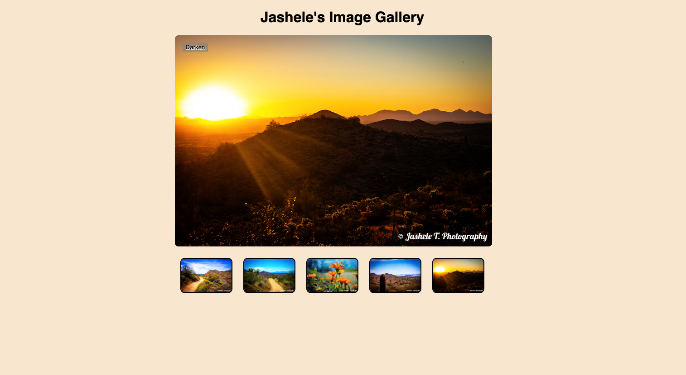

# JS Image Gallery Project

To test comprehension of JavaScript loops, functions, conditionals, and events.

Demo @ https://jasheloper.github.io/img-gallery-js-2/

**not entirely optimized for mobile, simple JS practice exercise only. please view in desktop.*

 

**Additional edits beyond requirements:**
- Replaced project images with my own
- Made tweaks to the original CSS

 

## Link to Requirements:

https://developer.mozilla.org/en-US/docs/Learn/JavaScript/Building_blocks/Image_gallery 
